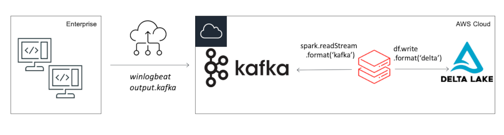

# Kafka-in-Docker

Docker compose file to bring up a Kafka and Zookeeper install for testing purposes. 

This build has been put together as part of the Databricks blog demonstrating a simple architecture for consuming windows endpoint logs into Databricks, using winlogbeats on the endpoint to send sysmon events via kafka. It is read and processed by the notebook [link](https://somelink.com).

You can use it to quickly spin up an instance of kafka for testing purposes. Please DO NOT try using it for production use cases. It works for my simple needs, and will work for readers of the blog researching how to re-create the simple architecture. 



## Pre-Requisites

Best installed on a fresh AWS instance since it uses the metadata service to configure advertised.listener. If you want to run this somewhere else, change the docker-compose.yml file.

* Create an EC2 Instance, with a MINIMUM of 16GB Ram. Anything less will fail the install.
* If you plan to send data to the Kafka server from outside of the cloud provider, create an inbound security group rule for TCP 9094.

I have tested this on t2.xlarge Ubuntu 20.04 which works for my purposes. 

## Installation

The install.sh script will download and install docker, docker-compose and everything else you need to get up and running. You'll need to download the repo and execute the install script however.

```
git clone https://github.com/DerekKing001/kafka-in-docker.git
cd kafka-in-docker
sudo ./install.sh
```

If you want to have the instance install and run kafka instantly run the following in from the ec2 userdata section.

```
git clone https://github.com/DerekKing001/kafka-in-docker.git 1>>/var/log/install.log 2>&1
cd kafka-in-docker 1>>/var/log/install.log 2>&1
sudo ./install.sh 1>>/var/log/install.log 2>&1
```

### Checking and Testing the Installation
Once installed, you'll probably want to check a few things out. Logon to the host via ssh.

**Example EC2 based on ubuntu**

```ssh -i <pem_file> ubuntu@<hostname>```

#### Is my docker env running?

```sudo docker ps```

#### Check the logs

```sudo docker logs --follow docker-kafka-1```

#### Run a shell on the Kafka Server
```sudo docker exec -it docker-kafka-1 bash```

#### Testing the topics created OK?

After running a shell on the kafka container

```
cd /opt/kafka/bin
./kafka-topics.sh --bootstrap-server <hostname> --list
```
By default, the compose file is setup to create the 'winlogbeat' topic only. 

#### Produce a test message

from /opt/kafka/bin

``` ./kafka-console-producer.sh --bootstrap-server <hostname>:9094 --topic winlogbeat```

input is received until CTRL-d

#### Consume the test message

from /opt/kafka/bin

```./kafka-console-consumer.sh --bootstrap-server <hostname>:9094 --topic winlogbeat --from-beginning```

## Configuration

Use the docker-compose.yml file to pass in kafka variables if needed. 

### Topics

Initially the topic winlogbeat will be configured. If you want to add more topics, amend the KAFKA_CREATE_TOPICS accordingly. This is a comma separated config

```

KAFKA_CREATE_TOPICS: "winlogbeat:1:1, an-other-topic:1:1"

```

where: 1:1 corresponds to the partition(s), and replica(s) you want.

### Listening Ports

The compose file is set to expose TCP 9092 for the internal listener, and 9094 for the external. Make sure when producing or consuming messages you use the external listening port (9094).


